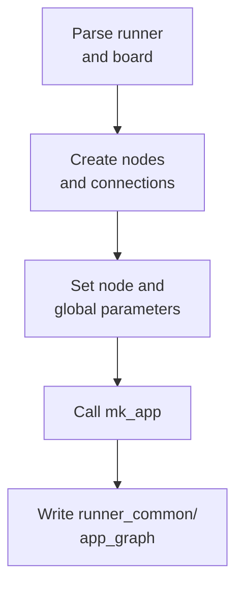

# Configuring and generating an application

Each application has a Python script that describes its CMSIS-Stream graph, selects a runner and board, defines application parameters, and generates the C/C++ graph. This guide uses `examples/recorder/create.py` as a concrete example.

For the architecture behind these steps, see [How the project works](principles.md).

## Prepare the Python environment

The generation scripts require the CMSIS-Stream Python package. Activate the workspace virtual environment before running them. For the current workspace on Windows:

```powershell
.\.venv\Scripts\Activate.ps1
```

Run the commands below from the repository root.

## Select the runner and board first

The recorder starts by parsing the target options:

```python
from examples.common.app import configure_app_from_args, mk_app

config = configure_app_from_args()
```

`configure_app_from_args()` reads `--runner` and `--board`, validates them, and stores the selection where node descriptions can access it. This call must happen before constructing nodes because a node may choose its C/C++ implementation from the selected target.

For example, the generic `MicrophoneSource` description reads the selected runner and chooses one of these implementations:

* `src/posix/MicrophoneSource.hpp`
* `src/zephyr/MicrophoneSource.hpp`
* `src/cmsis/MicrophoneSource.hpp`

Typical recorder generation commands are:

```powershell
# POSIX; Windows, Mac, or Linux is detected from the host
python examples/recorder/create.py --runner posix

# Zephyr on the Corstone-300 FVP
python examples/recorder/create.py --runner zephyr --board fvp_cs300

# CMSIS-RTOS on the Corstone-300 FVP
python examples/recorder/create.py --runner cmsis --board fvp_cs300

# CMSIS-RTOS on Alif Ensemble E7
python examples/recorder/create.py --runner cmsis --board AlifE7
```

On POSIX, `--board` may be omitted and is derived from the host. For an embedded runner, specify the board explicitly when the application needs board-specific hardware support.

## Define the graph

The recorder creates a graph with a microphone source and debug sink:

```python
from cmsis_stream.cg.scheduler import Graph, CType, SINT16
from nodes.generic import DebugSink, MicrophoneSource

the_graph = Graph()

sample_type = CType(SINT16)
mic_sample_rate = 16000
block_size = mic_sample_rate // 10

src = MicrophoneSource("src", sample_type, block_size)
sink = DebugSink("sink", sample_type, block_size)

the_graph.connect(src.o, sink.i)
```

`block_size` is the number of samples produced and consumed per node execution. Here it represents 100 ms of 16 kHz audio. `the_graph.connect(src.o, sink.i)` connects the source data output to the sink data input.

CMSIS-Stream also supports event connections. Event outputs carry messages to event inputs synchronously or through an asynchronous event queue. Refer to the CMSIS-Stream [event documentation](https://github.com/ARM-software/CMSIS-Stream/blob/main/Documentation/Events.md) when an application needs event connections.

## Configure node and application parameters

Node descriptions can provide default parameters in `self.params`, and an application can override them either in the node constructor or through `mk_app(params=...)`. The generator collects those values in the graph-wide `AppParams` structure and gives each generated C++ node only its own parameter member.

The recorder also defines compile-time values with `globals`:

```python
mk_app(
    the_graph,
    globals={
        "MIC_BLOCK_SIZE": block_size * sample_type.bytes,
        "MIC_SAMPLE_RATE": mic_sample_rate,
        "MIC_CHANNELS": 1,
        "MIC_FRAMES_PER_BUFFER": 0,
        "MIC_SAMPLE_SIZE": sample_type.bytes * 8,
        "APP_SRC_VALUE": 2,
    },
    config=config,
    debug_limit=10,
)
```

These values become C preprocessor definitions in `app_params.h`. They configure board code that must know the audio format or allocate buffers at compile time:

* `MIC_BLOCK_SIZE` is expressed in bytes, while the Python node's `block_size` is expressed in samples.
* `MIC_SAMPLE_RATE` and `MIC_CHANNELS` configure the audio peripheral.
* `MIC_FRAMES_PER_BUFFER` configures the POSIX PortAudio path.
* `MIC_SAMPLE_SIZE` is the number of bits per sample.
* `debug_limit=10` limits generated scheduler execution for this example.

Keep related graph and hardware values consistent. For example, changing the sample type or channel count may require updating the byte size, node type, and board-supported audio format together.

For the detailed Python-to-C parameter mapping, including typed `(literal, type)` parameters and hardware injection, see [Application and node parameters](principles.md#application-and-node-parameters).

## Generate the application

`mk_app()` performs the generation after the graph and parameters are complete:



The most important generated files are:

* `scheduler_app.cpp` and `scheduler_app.h`: generated FIFOs, nodes, and schedule.
* `AppNodes.hpp`: target-specific C++ node includes.
* `app_params.h` and `app_params.c`: graph parameters and compile-time definitions.
* `board_config.cmake`: selected runner and hardware target for CMake-based runners.
* `app.dot` and `app.png`: graph visualization.

The output represents one runner/board combination. Generating for another target replaces it. Do not edit generated files manually; change the Python description and run `create.py` again.

## Build the selected runner

Build the same runner for which the graph was generated:

* [POSIX runner](posix_runner.md): CMake desktop build.
* [Zephyr runner](zephyr_runner.md): Zephyr build, which uses CMake internally.
* [CMSIS runner](cmsis_runner.md): CMSIS Toolbox build from the solution and project YAML files; it does not use the shared CMake build.

The selected runner must provide every implementation included by `AppNodes.hpp`, and the selected board support must provide a compatible `HardwareParams` definition and peripheral initialization.

## Adapting the recorder

To turn the recorder into another application:

1. Import the required generic or target-specific Python node descriptions.
2. Parse the runner and board before constructing nodes.
3. Create the nodes with compatible data types and block lengths.
4. Connect their dataflow and, when needed, event ports.
5. Define per-node parameters and application-wide compile-time values.
6. Call `mk_app()` with the selected configuration.
7. Build the runner matching the generated target.

[Back to the project README](../README.md)
