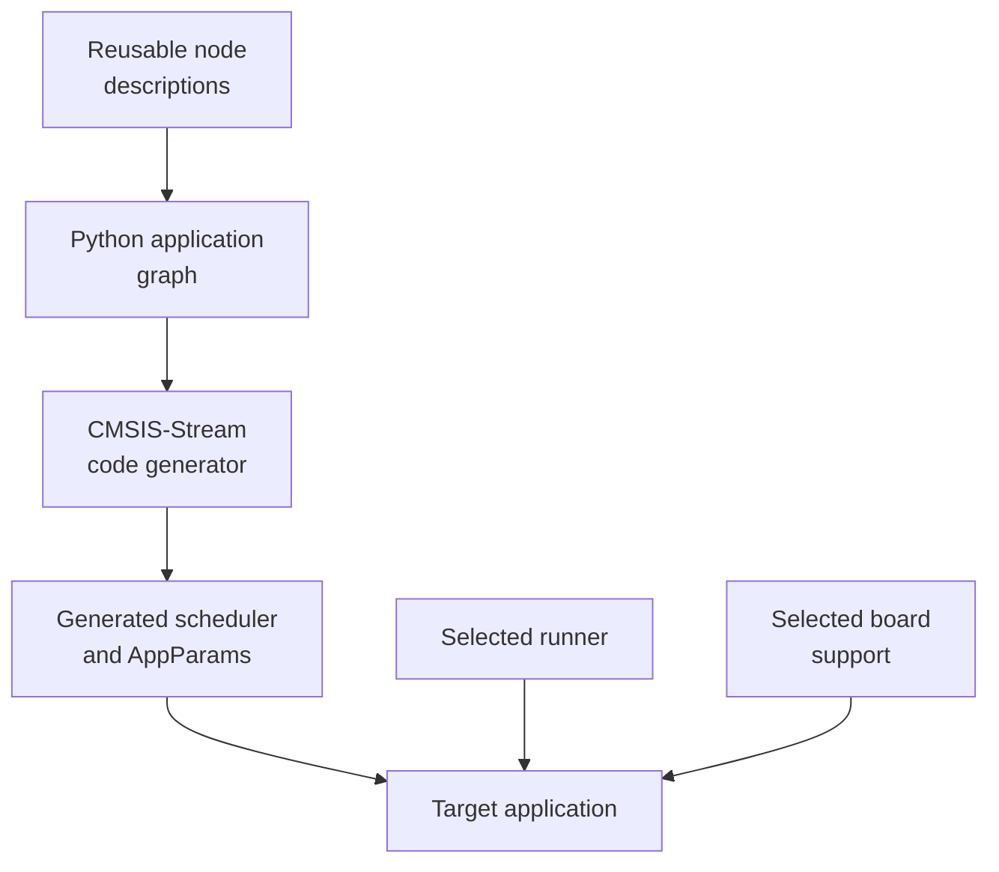
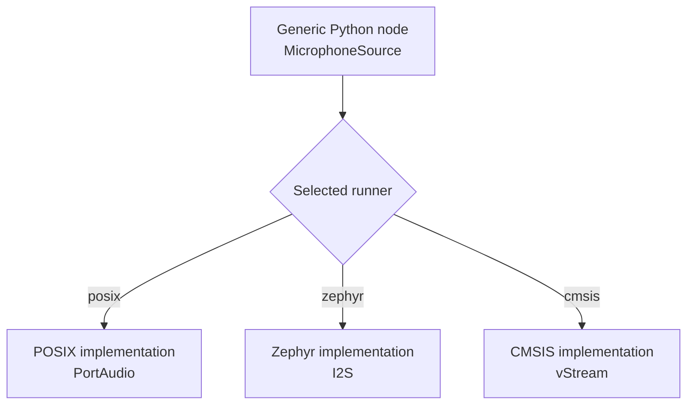
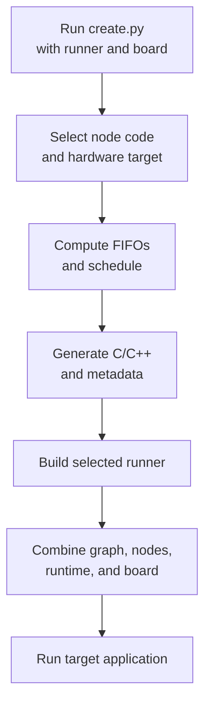
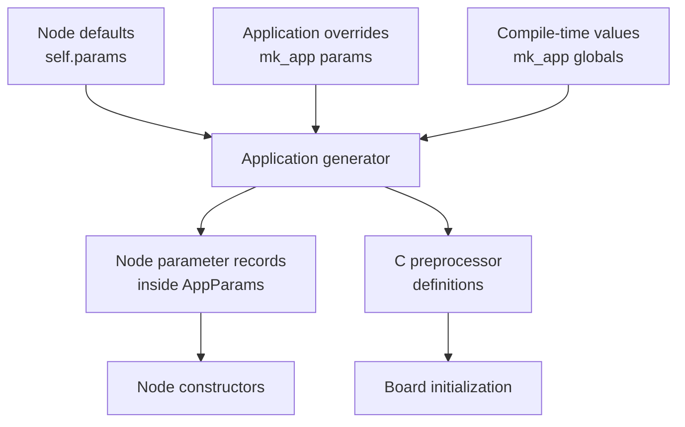
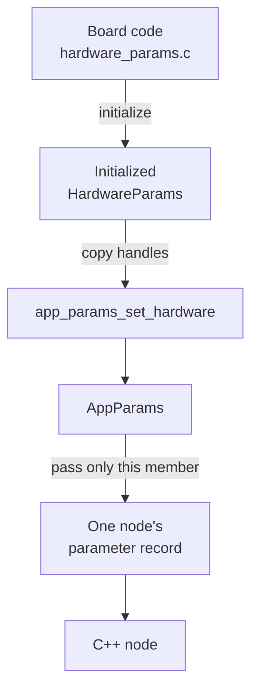
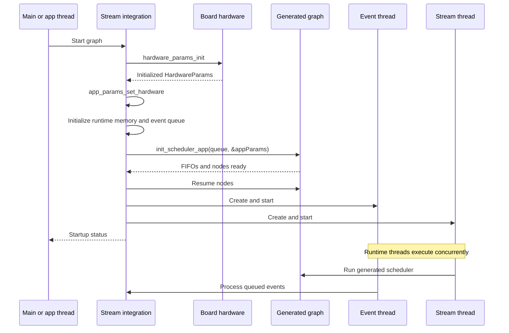
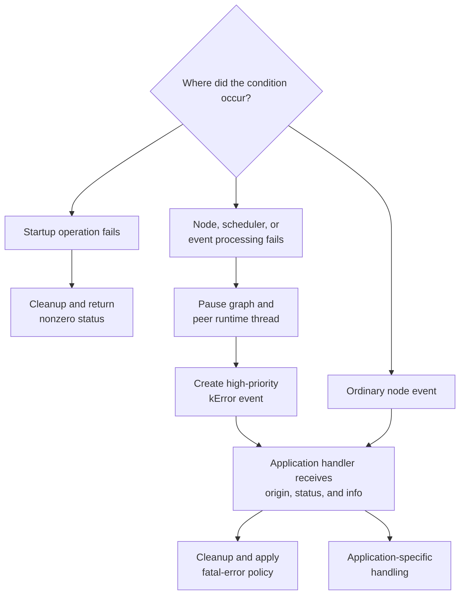

# How the project works

This project makes CMSIS-Stream graphs portable across desktop operating systems, RTOS environments, and boards. An application describes its graph and configuration in Python. Generation turns that description into a C/C++ scheduler and parameter structures. A runner then combines the generated graph with the implementation and hardware support selected for one target.

## Architecture at a glance



The main pieces are:

* `examples/<application>/create.py`: describes one application graph and its configuration.
* `examples/common/app.py`: reads the runner and board command-line options, makes that target selection available to node descriptions, configures CMSIS-Stream generation, and generates application parameters and build metadata.
* `nodes/`: contains the Python node descriptions used to construct graphs.
* `src/`: contains shared and target-specific C/C++ node implementations.
* `boards/<runner>/<board>/`: initializes target peripherals and exposes them through `HardwareParams`.
* `<runner>_runner/`: provides the target build and application entry point.
* `runner_common/`: contains the shared integration layer and generated graph.

## Describing a graph in Python

An application uses both the CMSIS-Stream Python API and the helpers in `examples/common/app.py`. The recorder example follows this pattern:

```python
from cmsis_stream.cg.scheduler import Graph, CType, SINT16
from examples.common.app import configure_app_from_args, mk_app
from nodes.generic import MicrophoneSource, NullSink

config = configure_app_from_args()

graph = Graph()
sample_type = CType(SINT16)
block_size = 1600

source = MicrophoneSource("src", sample_type, block_size)
sink = NullSink("sink", sample_type, block_size)
graph.connect(source.o, sink.i)

mk_app(graph, config=config)
```

CMSIS-Stream provides `Graph`, data types, base node classes, ports, connections, schedule computation, and C/C++ code generation. This project provides the application configuration helpers and reusable nodes.

`configure_app_from_args()` analyzes the `--runner` and `--board` command-line options, validates each option, and stores the selected target in the shared application configuration. It does not validate every runner/board pairing; use a board supported by the selected runner. On POSIX, it derives the board from the host operating system when `--board` is omitted. Node descriptions created afterward can call `get_app_config()` and use the selected runner and board to choose a shared, runner-specific, or board-specific C/C++ implementation. For example, `MicrophoneSource.folder` returns the selected runner name. The same configuration is passed to `mk_app()` so that generation records the matching hardware target. This is why target configuration must happen before nodes are constructed.

A CMSIS-Stream graph can mix two kinds of connections:

* A **dataflow connection** carries blocks of samples through a FIFO. The recorder's `graph.connect(source.o, sink.i)` is a dataflow connection. CMSIS-Stream uses the production and consumption sizes to compute FIFO sizes and a schedule.
* An **event connection** carries a message from an event output to one or more event inputs. An event has an identifier and may have arguments. It can be delivered synchronously, by immediately calling the destination, or asynchronously through the event queue.

This guide only uses that vocabulary to explain this project's integration. Refer to the CMSIS-Stream documentation for the full [Python graph model](https://github.com/ARM-software/CMSIS-Stream/blob/main/Documentation/WritePython.md) and [event model](https://github.com/ARM-software/CMSIS-Stream/blob/main/Documentation/Events.md).

## Generic and target-specific nodes

A generic node represents an operation that makes sense on more than one runner or board. Its public Python description stays the same even when its C/C++ implementation or hardware access differs by target.

`MicrophoneSource` is an example. The application always imports it from `nodes.generic`, but its `folder` property selects `posix/MicrophoneSource.hpp`, `zephyr/MicrophoneSource.hpp`, or `cmsis/MicrophoneSource.hpp` from the active runner. All implementations have the same graph-level purpose and compatible ports and parameters.

A generic node can use either:

* One shared implementation from `src/generic/` when no target adaptation is needed.
* Several implementations from runner- or board-specific folders when the operation is portable but the underlying API is not.

A non-generic node only makes sense in one environment. For example, a WAV file node depends on filesystem and file-format facilities available to the POSIX application, so its description lives under `nodes/posix/` and its implementation under `src/posix/`. A board-specific node may similarly depend on an accelerator, peripheral, or driver that does not exist elsewhere.



The distinction is about the node's meaning, not whether every line of implementation is shared. If applications can use the same graph-level node across meaningful targets, it is generic. If the node exposes a facility unique to one environment, it is target-specific.

## Generating and building an application

Each example provides a generation script such as `examples/recorder/create.py`. Select a runner and board on its command line:

```powershell
uv run examples/recorder/create.py --runner zephyr --board fvp_cs300
```

`configure_app_from_args()` performs the command-line selection described above. `mk_app()` then configures the CMSIS-Stream generator and writes the result to `runner_common/app_graph/`. See [Configuring and generating an application](configuring_application.md) for a complete walkthrough based on the recorder.

The generated output includes:

* `scheduler_app.cpp` and `scheduler_app.h`: graph FIFOs, node construction, and the static schedule.
* `AppNodes.hpp`: includes the C++ node implementations selected by the Python descriptions.
* `app_params.h` and `app_params.c`: parameter types and initialized values.
* `board_config.cmake`: selected runner, board, and hardware target.
* `json/`: node identification and selector metadata.
* `app.dot` and, when Graphviz is installed, `app.png`: a visualization of the graph.

Generation produces the graph for one runner/board selection at a time. Running another generation command replaces the files in `runner_common/app_graph/`.



The POSIX and Zephyr builds use CMake. Their runner `CMakeLists.txt` files include `runner_common/CMakeLists.txt`, which reads `board_config.cmake`, selects `boards/<runner>/<board>/`, and combines the generated sources with common node sources and the CMSIS-Stream runtime.

The CMSIS runner does not use CMake. CMSIS Toolbox reads `cmsis_runner/CMSIS.csolution.yml` and `cmsis_runner/src/cmsis_runner.cproject.yml`. The solution selects a board layer, and that layer supplies the matching hardware sources and include paths. The project file adds the generated scheduler and parameter sources.

Runner-specific build commands are documented in the [POSIX](posix_runner.md), [Zephyr](zephyr_runner.md), and [CMSIS](cmsis_runner.md) guides.

## Application and node parameters

Parameters originate in Python and become generated C data. There are two complementary kinds.

### Per-node parameters

A Python node description declares the parameters understood by its C++ implementation. For example, `MicrophoneSource` creates a `num_channels` parameter and allows the application to override its default:

```python
self.params = {
    "num_channels": _microphone_channels(theType),
}
if params:
    self.params.update(params)

self.addVariableArg(f"params->{name}")
```

The recorder creates a microphone node named `src` and a null sink named `sink`:

```python
src = MicrophoneSource("src", sample_type, block_size)
sink = NullSink("sink", sample_type, block_size)
```

Because `src` has a parameter and needs hardware, generation creates a parameter type for it. `sink` has neither parameters nor hardware access, so it does not need an `AppParams` member. The relevant part of the generated `app_params.h` is:

```c
typedef struct {
    HardwareParams hw_;
    int32_t num_channels;
} MicrophoneSourceParams;

typedef struct {
    MicrophoneSourceParams src;
} AppParams;
```

`AppParams` represents the parameters for the complete graph. It contains one member per node instance that has configurable parameters or needs hardware access. Each member is named after the Python node instance.

The values from Python initialize the global graph parameters in `app_params.c`:

```c
AppParams appParams = {
    .src = {
        .num_channels = 1,
    },
};
```

An application can override or add values by node instance name through the `params` argument to `mk_app()`. These values take precedence over defaults from the node description:

```python
mk_app(
    graph,
    params={"src": {"num_channels": 1}},
    config=config,
)
```

Booleans, integers, and floating-point values become `uint8_t`, `int32_t`, and `float`. Use a `(literal, type)` tuple when a value must keep a more specific C type or refer to a C expression. The recorder contains this alternative debug source example:

```python
sample_type = CType(SINT16)
src = DebugSource(
    "src",
    sample_type,
    block_size,
    params={"value": ("APP_SRC_VALUE", sample_type)},
)

mk_app(
    graph,
    globals={"APP_SRC_VALUE": 2},
    config=config,
)
```

Here, `"APP_SRC_VALUE"` is the C literal or macro expression and `sample_type` supplies the C type, `int16_t`. Generation therefore produces a field and initializer equivalent to:

```c
int16_t value;
/* ... */
.value = APP_SRC_VALUE,
```

The generated scheduler receives `&appParams`, but a node does not receive this full graph structure. For a node named `src`, `addVariableArg(f"params->{name}")` makes the generated constructor receive only `params->src`.

Nodes with the same `typeName` share one generated parameter type and must therefore use the same parameter field layout.

### Application-wide compile-time parameters

The `globals` argument to `mk_app()` generates C preprocessor definitions:

```python
mk_app(
    graph,
    globals={
        "MIC_SAMPLE_RATE": 16000,
        "MIC_CHANNELS": 2,
        "MIC_BLOCK_SIZE": 3200,
    },
    config=config,
)
```

These definitions are written to `app_params.h`. They are useful when board initialization, buffer allocation, driver configuration, and node code must agree at compile time. In the recorder, the microphone sample rate and buffer geometry configure the selected audio peripheral implementation.



Do not edit `app_params.h` or `app_params.c` manually; they are regenerated from Python.

## Hardware initialization and `HardwareParams`

Peripheral initialization belongs to the selected hardware target under `boards/<runner>/<board>/`. Each target provides a `hardware_params.h` and `hardware_params.c` with the same integration functions but a target-specific `HardwareParams` definition.

For example, the structure may hold:

* A PortAudio stream on POSIX.
* A Zephyr device and memory slab for I2S.
* A CMSIS vStream driver and RTOS event flags.

The shared startup code performs this sequence:

1. Allocate a shared `HardwareParams` value.
2. Call `hardware_params_init(&hardwareParams)` to configure peripherals and store their handles and metadata.
3. Call `app_params_set_hardware(&hardwareParams)`. This generated function copies `HardwareParams` into the parameter record of every node whose Python description has `needsHardware == True`.
4. Pass each node's own parameter record, such as `appParams.src`, to its C++ constructor.

The `HardwareParams` structure should contain values that are cheap and safe to copy and share, such as driver pointers, RTOS handles, device pointers, IDs, and small configuration values. It should not contain large buffers or objects whose ownership would be duplicated by a shallow copy. The real peripheral resources remain owned by the board layer.

This design gives every hardware-dependent node the handles it needs without exposing the parameters for the full graph. A node receives only its own `<NodeType>Params` record and accesses hardware through that record's `hw_` member. Nodes that do not need a peripheral have no `hw_` member. At shutdown, the board layer's `hardware_params_uninit()` stops and releases the shared resources.



`app_params_set_hardware()` makes one cheap copy for each node that needs hardware. Those copies refer to the same underlying resources, whose lifetime remains the responsibility of the board layer.

## Runner startup and threads

All runners call the shared `stream_configure_and_start()` integration function, but the point at which they call it depends on the platform's thread-startup model.

* POSIX calls it directly from `main()`. The runtime's `std::thread` objects start executing as soon as they are created.
* Zephyr also calls it directly from `main()`. Zephyr is already running its kernel when application `main()` executes, and the runtime creates its threads with `k_thread_create(..., K_NO_WAIT)`, so the event and stream threads start immediately. It does not need an extra application thread to ensure the kernel is running.
* The CMSIS runner initializes the board and CMSIS-RTOS kernel, creates `app_main`, and then calls `osKernelStart()`. `app_main` calls `stream_configure_and_start()` only after the kernel scheduler has started. This matters for CMSIS-RTOS implementations where threads created before kernel start do not execute yet, and it also lets node `resume()` functions use RTOS resources safely.

Startup proceeds in this order:

1. Initialize `HardwareParams` and distribute it to node parameter records.
2. Initialize CMSIS-Stream runtime memory and synchronization objects.
3. Create an event queue and attach the application event handler.
4. Initialize the generated FIFOs and node objects with `appParams`.
5. Build a `stream_execution_context_t` containing scheduler, FIFO reset, node pause/resume, node lookup, event queue, and schedule metadata callbacks.
6. Resume the graph nodes.
7. Start the CMSIS-Stream event thread and stream thread.



The stream thread repeatedly runs the generated dataflow scheduler. It executes nodes according to the static schedule and reacts to stop, pause, and node error results.

The event thread drains the priority event queue. It dispatches asynchronous events to graph nodes or to the application handler. Synchronous events do not wait for this thread; they call their destination or the application handler immediately.

The runner's original application thread remains separate. POSIX and Zephyr wait for both runtime threads with `stream_wait_for_threads_end()`, then call `stream_free_all()`. On CMSIS-RTOS, the kernel schedules the application and runtime threads.

## Integrating the graph into an application

The shared integration layer exposes three lifecycle operations:

* `stream_configure_and_start()` initializes and starts the graph, returning a status for startup failures.
* `stream_wait_for_threads_end()` waits for the runtime threads where the runner's application model requires it.
* `stream_free_all()` stops threads and releases graph, event queue, runtime memory, and hardware resources.

An application should treat failures in two phases.

### Startup failures

Hardware setup, runtime memory, event queue allocation, generated scheduler initialization, or thread creation can fail before execution starts. `stream_configure_and_start()` logs the failure, cleans up initialized resources, and returns a nonzero status. The POSIX and Zephyr entry points return that status from `main()`; an embedded application can instead report it through its platform fault manager.

### Runtime events and errors

During execution, an identified node can send synchronous or asynchronous events to the application. `stream_configure_and_start()` installs `application_handler` on the graph's event queue. The handler receives:

* The source node ID.
* Application context data, currently the network ID.
* The event ID, priority, and typed payload.

The current handler logs ordinary events. Applications can extend this integration point to update state, notify a UI, publish telemetry, or request another application action.

Scheduler failures and event-processing failures are converted by the CMSIS-Stream runtime into a high-priority `kError` event with three `int32_t` values:

1. Error origin, such as the stream thread or event thread.
2. CMSIS-Stream status code.
3. Additional error information.

The current `kError` handler stops runtime threads, frees the graph and hardware resources, and calls `CMSISSTREAM_FATAL_ERROR(1)`. The Zephyr runner maps that hook to `k_panic()`; other runners may override it in their application configuration to integrate with their own fatal-error policy.



When adapting the handler, preserve the cleanup ordering and remember that a runtime error may be reported from a runtime thread. `stream_free_all(true)` tells the shutdown path that its caller is one of those threads and avoids waiting on itself while still stopping its peer safely.

[Back to the project README](../README.md)
