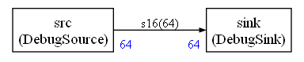

# Recorder CMSIS-Stream POSIX Example

This is a skeleton CMSIS-Stream POSIX application. Its graph is described from
Python in `python/create.py` and currently contains a single debug path:



`DebugSource` writes zeros to its output block. `DebugSink` consumes one block
per scheduler run and prints the total number of samples received so far.

The Python node descriptors live in `../../nodes/generic`. The C++ node
templates live in `../../src/generic` and are included by the generated
`recorder_graph/AppNodes_recorder.hpp`.

Regenerate the scheduler:

```powershell
cd examples/recorder/python
python create.py
```

Configure and build with the installed CMSIS-Stream POSIX runtime package:

```powershell
cmake -S examples/recorder -B examples/recorder/build -DCMSIS_STREAM_INSTALL_PREFIX=C:/cmake_packages
cmake --build examples/recorder/build
```

Run:

```powershell
.\examples\recorder\build\Debug\recorder.exe
```

The recorder stream runs until the POSIX runtime is stopped.
